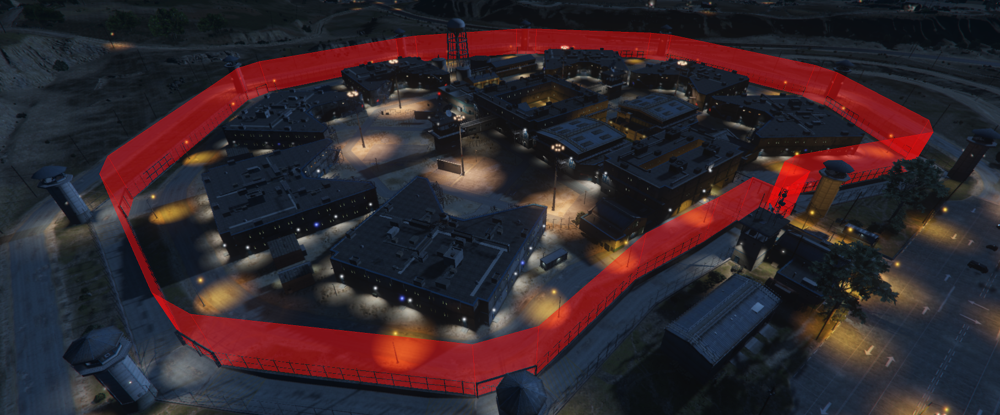

Paradise Area
=============

This is a useless resource for end-users. It is intended for developers of [FiveM](http://fivem.org) resource, to aid them in detecing if a user is in a specified area.
If you are not a developer, then this is not meant for you.

## What does it look like, though? ##

If you're not just checking, but actually drawing the outline, it looks something like this:

Mostly, though, it's recommended that you only do the inside/outside check, and put the edges somewhere that makes sense on the map. In the example, I use the inner perimeter of Bolingbroke Penitentiary.

## Sweet! What happens if I go inside the area?! ##

I have no idea. That's up to you to script. This is *not* intended to be used on it's own, but merely as a tool for developers to use. As you can tell from the example, I use it for my prison system, but it can be used for anything you want.

No, I will not be releasing the steaming pile of bugs that is my prison system.

## Where do I begin? ##

First, you do the downloading and the `server.cfg` stuff as per usual.

In the `dependencies` section of your `__resource.lua`, add `'paradise-area'`.
In the `client_scripts` section, you may add `'@paradise-area/area.lua'`, or you can use the available exported function.

Working through exports is really slow, so I do not recommend it.
If someone could point out what I did wrong to make it this slow, that'd be great.

First, you must obtain a `pArea` object, and after that the `@lua` method and the exported function method are exactly the same, aside from the horrible slow-downs from the export.
```lua
-- The @lua way:
local muhArea = pArea()
```
**or**
```lua
-- The exports way:
local muhArea = exports['paradise-area']:create()
```
There are some options when creating it, but we'll get to that later.

Next, you need to add a bunch of points define your outline. If there are less than three, it'll refuse to draw it, and checking if you are inside it will always be false. You can't be *inside* a line.

**When adding the points, keep in mind that you are defining *the floor* of your polygonal area.**

```lua
-- Parking space outside Bolingbroke.
muhArea.addPoint(vector3(1866.8092,2613.3381,44.672))
muhArea.addPoint(vector3(1873.2631,2613.3623,44.672))
muhArea.addPoint(vector3(1873.2416,2616.8735,44.672))
muhArea.addPoint(vector3(1866.7888,2616.8391,44.672))
```
Congratulations, you have yourself an *area*.

In most cases, however, you don't want to add the points one by one. You can add them in bulk, like so:
```lua
-- Same data, different way to add the points:
muhArea.addBulk(
    vector3(1866.8092,2613.3381,44.672),
    vector3(1873.2631,2613.3623,44.672),
    vector3(1873.2416,2616.8735,44.672),
    vector3(1866.7888,2616.8391,44.672) -- Mind the lack of a trailing comma!
)
```
How you obtain these coordinates is up to you, obviously, but they are *only* accepted in `vector3` format. Here they define a flat, square area, but you can make it all bumpy and Mickey Mouse shaped, if you want.

Yes, concave shapes are fine.

## Uh, okay? Now what? ##

Now you ask if a point is inside that area, like so:

```lua
muhArea.isInside(somePoint) -- Where somePoint is an *optional* vector3!
```
This will return `true` if that point is inside, `false` if it's not. If you leave out `somePoint` it will fetch the coordinates of your player ped and use that.

## It's not working! I'm inside, but it claims I'm not! ##

Well, maybe you screwed up some of the points? You can debug it by making the border visible.
```lua
muhArea.draw(somePoint) -- Where somePoint is an *optional* vector3!
```

The point specified when drawing is only used to determine your distance from the center of the area, so that the proper "fade" can be applied to the border. Don't worry, the "fade" stuff will be explained in the options section.

Keep in mind that drawing the border is relatively heavy work, and should not be done unless you *have to*. It *will* slow the game down, and if you are drawing a bunch of areas in close proximity your users will hate you for it.

If you leave out the comparison point, the coordinates of the currently rendering camera is used.

If it's still not working, please see the Limitations section at the end of this document.

## OMG IT'S TOO SLOW!!! ##

There are a handful of things you can do:
- Stop drawing the area! That's not optimized at all, and is considered a debugging feature.
- Simplify your border a little.
- Don't add points to the border at run-time (it forces center/radius recalculation).
- Build some wrapping logic to determine if you even need to check if you're in the area.
- Submit a pull request with your speeded up code.

## What are the configuration options? ##

When creating the object, you can specify a handful of options, like so:
```lua
local muhArea = pArea({ -- Assuming @lua method here! Defaults are:

    -- The distance from the highest of the points to what is considered
    -- "the ceiling" of your area
    height = 2.0,

    -- The color, in {Red,Green,Blue,Alpha}, of a fully saturated wall
    color = {255,255,255,60},

    -- The color, in {Red,Green,Blue,Alpha}, of a fully saturated "fence post"
    border = {255,255,255,60},

    -- The distance, in meters, from the center point to where the .draw() call
    -- produces entirely transparent walls/posts. If both the walls and the posts
    -- are transparent, it will not attempt to draw invisible lines and polygons.
    fade = 100,

    -- For performance reasons, the algorithm to determine if you are inside or
    -- outside the area is rather naive, and has relatively low presicion.
    -- It was either this, or limit it to convex polygons!
    -- There is a certain "fudge factor" applied as a magic number. This magic
    -- number is called...
    threshold = 3.25,
})
```

Note that if `fade <= 0`, then this feature is disabled, and the area is *always* drawn.
This is not recommended, and almost never needed, even for debugging.
Also note that the "center point" is a very naive calculation. It is simply the *average* of all the points in the area.
Fiddle with the threshold only if you want to break things, or *really* need to.

## Can I just sort of try it out first? ##

Sure. There is a "demo mode" included in `area.lua`, and you can activate it by editing...
```lua
if false then -- Change to true for "demo mode"
```
...to..
```lua
if true then -- Change to true for "demo mode"
```
...towards the end of the script. This will activate my testing areas. Go to the front entrance of Bolingbroke Penitentiary, and you'll be sure to spot them.


## Limitations ##

- Performance is not what I'd like it to be.
- The "fudge factor" means presicion goes out the window for very complex area borders.
- The code is severely undercommented, so it's probably not very friendly towards people that want to fix my msitakes.
